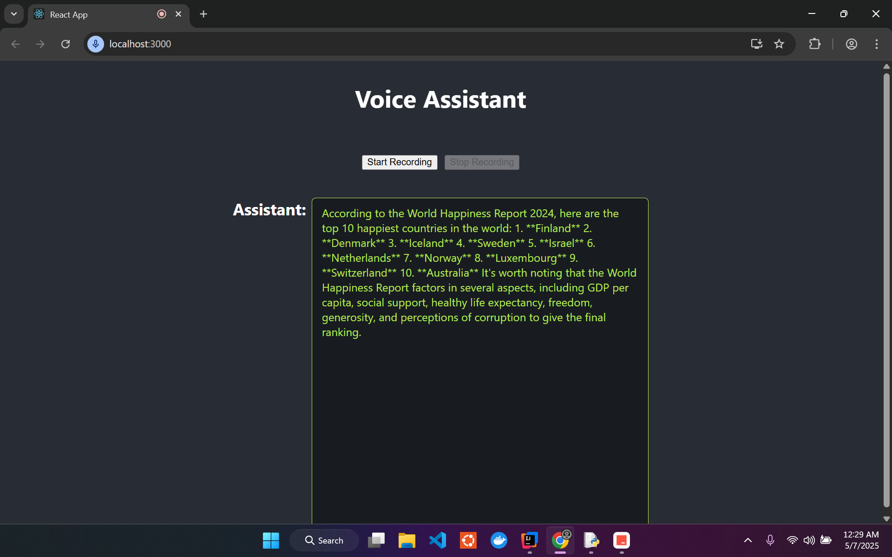

# Voice Assistant Project

## Overview
This project is a full-stack voice assistant application featuring a React frontend and a Spring Boot backend. It enables users to interact with the system using voice commands, leveraging modern web technologies and speech APIs.

## Tools and Technologies Used
- **Wit.ai**: Provides speech-to-text capabilities, converting user voice input into text for further processing.
- **Gemini (Google Gemini API)**: Powers the conversational AI, interpreting user intent and generating intelligent responses.
- **React**: Frontend framework for building the user interface and handling real-time interactions.
- **Spring Boot**: Backend framework for managing API endpoints, business logic, and integration with AI services.

## How the App Works
1. **User Interaction**: The user clicks the microphone button in the React frontend and speaks a command.
2. **Speech Recognition**: The frontend uses Wit.ai to transcribe the spoken words into text.
3. **Request to Backend**: The transcribed text is sent to the Spring Boot backend via a REST API call.
4. **Conversational AI Processing**: The backend forwards the text to Gemini, which analyzes the intent and generates a response.
5. **Response Delivery**: The backend sends the AI-generated response back to the frontend, which displays it to the user in real time.

## Features
- Voice recognition and command processing
- Real-time communication between frontend and backend
- Configurable API keys for speech services
- Modular frontend (React) and backend (Spring Boot)

## Project Structure
- `/frontend` — React frontend application
- `/backend` — Spring Boot backend application

## Installation

### Prerequisites
- Node.js (v16+ recommended)
- npm (v8+ recommended)
- Java 17 or later
- Maven (for backend)

### Frontend Setup
1. Navigate to the frontend directory:
   ```sh
   cd frontend
   ```
2. Install dependencies:
   ```sh
   npm install
   ```
3. Start the development server:
   ```sh
   npm start
   ```
   The app will be available at [http://localhost:3000](http://localhost:3000).

### Backend Setup
1. Navigate to the backend directory:
   ```sh
   cd backend
   ```
2. Build the project:
   ```sh
   ./mvnw clean install
   ```
3. Run the Spring Boot application:
   ```sh
   ./mvnw spring-boot:run
   ```
   The backend will be available at [http://localhost:8080](http://localhost:8080).

## Configuration
- **API Keys:**
  - Place your speech API keys in the appropriate configuration files:
    - Backend: Configure in `application.properties`
- **CORS:**
  - Ensure CORS is enabled on the backend to allow requests from the frontend.

## Usage
1. Start both the frontend and backend servers as described above.
2. Open the frontend in your browser.
3. Use the microphone button to issue voice commands.
4. The backend processes commands and returns responses in real time.

## Troubleshooting
- **Frontend not connecting to backend:**
  - Check backend server is running and accessible at the configured URL.
  - Verify CORS settings in backend.
- **Speech recognition not working:**
  - Ensure API keys are set correctly.
  - Check browser permissions for microphone access.
- **Build errors:**
  - Ensure all prerequisites are installed and versions are compatible.

## Dependencies
- React, React DOM, Web Speech API (frontend)
- Spring Boot, Maven (backend)

## Output Example

Below is an example of the application's output:



This image demonstrates the result produced by the application, providing a quick visual reference for users to understand its functionality.

## Contributing
Pull requests are welcome. For major changes, please open an issue first to discuss what you would like to change.
